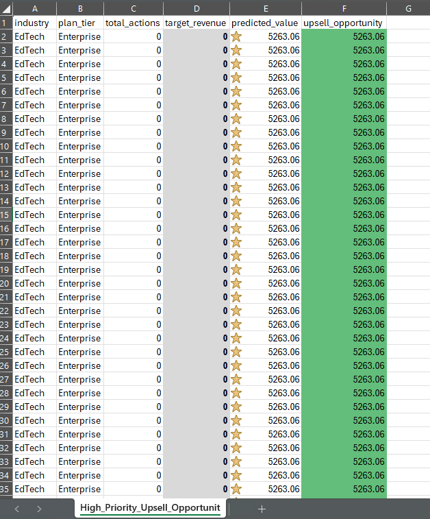
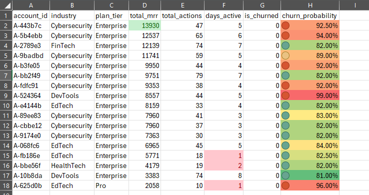

# Customer-Analytics-Revenue-Audit
Predictive churn modeling and revenue expansion forecasting using Python, SQL, and Machine Learning.

# Customer Health & Revenue Expansion Audit

# **Project Overview**

I developed a dual-layered analytics pipeline to solve two critical B2B SaaS challenges: **Churn Mitigation** (protecting revenue) and **Expansion Forecasting** (growing revenue). 

This project demonstrates a full data lifecycle: extracting data with SQL-style logic, building predictive models in Python, and delivering actionable "Hit Lists" in Excel.

---

## The Tech Stack
* **Python:** Pandas, Scikit-Learn (Random Forest & Linear Regression)
* **Strategy:** Revenue Operations (RevOps) & Customer Success Analytics
* **Visualisation:** Excel Dashboards with Conditional Formatting

---

## Phase 1: Revenue Expansion (Upsell Opportunities)
I used a **Linear Regression** model to predict the "Ideal Revenue" for each account based on industry benchmarks and usage intensity. By comparing this to their current spend, I identified the "Upsell Gap."

### The "Upsell Hit List"

* **Gold Stars:** Represent high-value Enterprise accounts with the highest growth potential.
* **Heat Map:** Highlights the specific dollar amount of the "Value Gap" for Sales outreach.
* **Insight:** Identified 1,800+ accounts that are currently under-monetized, including Enterprise accounts currently paying $0.

---

##  Phase 2: Retention Strategy (Churn Prediction)
I built a **Random Forest Classifier** to assign a "Risk Score" to every customer, identifying which high-value accounts were most likely to cancel based on their engagement patterns.

### The "At-Risk" Tracker

* **Visual Logic:** Uses a "Traffic Light" system (Red/Yellow/Green) to show churn probability.
* **Impact:** Allows the Customer Success team to prioritize outreach to the most valuable accounts before they churn.

---

## Repository Contents
* **`Revenue_Audit_Final.ipynb`**: The full Python source code, model diagnostics, and data cleaning steps.
* **`High_Priority_Upsell_Opportunities.xlsx`**: The formatted Excel Workbook for the Sales team (Download to view full icons/formatting).
* **`Retention_Risk_Analysis.xlsx`**: The formatted Churn report for the CS team.
* **`raw_data.csv`**: The raw dataset used for model reproducibility.

## Data Source
The analysis was performed on a B2B SaaS dataset sourced from Kaggle. 
*Note: To maintain data privacy, raw customer identifiers have been handled according to standard data governance practices.*
